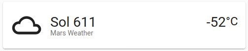

# Mars Weather Component

This is a custom component for [Home Assistant](https://www.home-assistant.io/) that provides Mars weather information.

It uses the [NASA Open APIs](https://api.nasa.gov/) to retrieve data from [Mars InSight Lander](https://mars.nasa.gov/insight/). It provides the following information:

- Sol
- Temperature (C)
- Air Pressure (Pa)
- Wind Speed (kmph)

## Installation/Configuration

To install the component, clone this repository and copy the `mars_weather` directory to your custom components directory in your config.

`config_dir/custom_components/mars_weather`

You will also need to register an account to get an API key. To generate a key, go to the [NASA Open API](https://api.nasa.gov/) page and register.

To register the integration in home assistant you will need to add it to your configuration. There is a choice between a sensor and weather type entity.

### Sensor

```yaml
sensor:
  - platform: mars_weather
    api_key: !secret nasa_api_key
```

### Weather
```yaml
weather:
  - platform: mars_weather
    api_key: !secret nasa_api_key
```


## Example Frontend

Here are some examples of how to add the integration to your frontend using the lovelace UI.

### Sensor
```yaml
cards:
  - type: sensor 
    entity: sensor.next_launch
```

### Weather
```yaml
cards:
  - type: weather-forecast
    entity: weather.mars_weather
```


